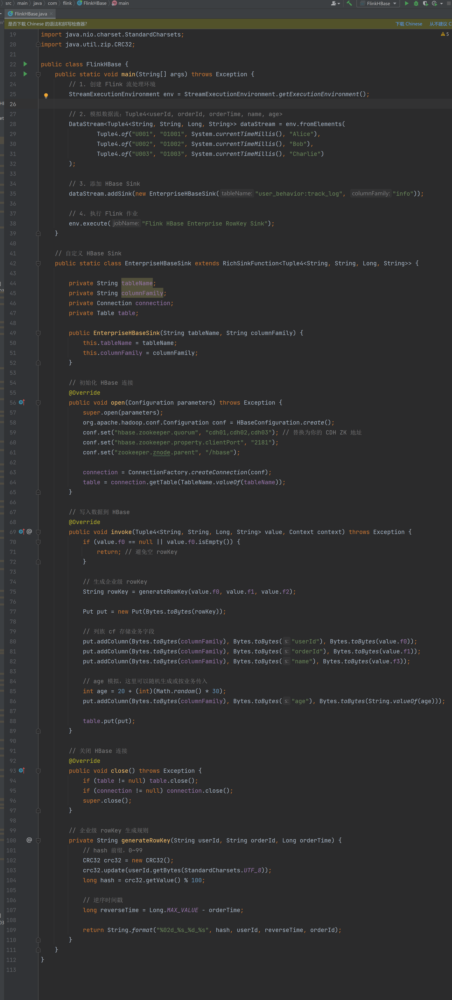
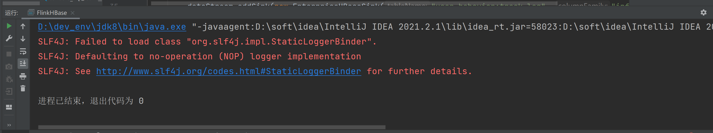
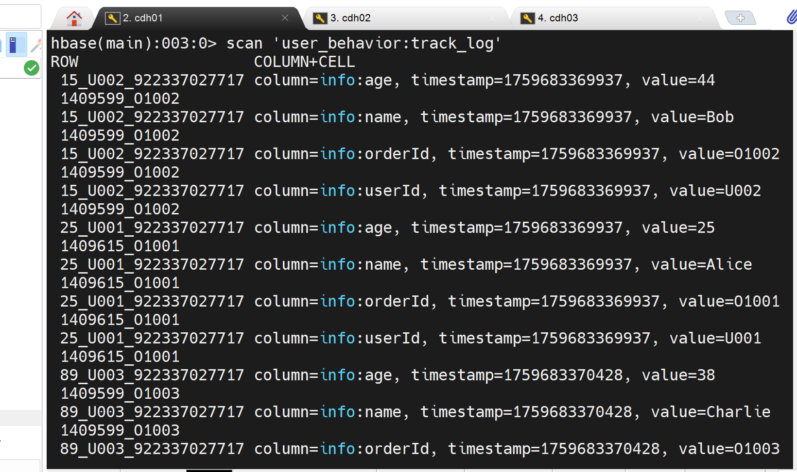

# . CDH 安装 hbase
# 创建 hbase 表, 数据由 Flink 写⼊ FlinkAPI 或者 FlinkSQL 都可以
# hbase rowkey 的设计, 符合企业原则
# hbase 数据进⼊后, 使⽤ hive 和 hbase 的映射表进⾏映射, 数据需要可查询, 实现可分区为佳

1.进入 HBase Shell 交互界面：
hbase shell

2.创建命名空间
命名空间用于隔离表（类似数据库的库），避免表名冲突：
shell
# 创建命名空间
create_namespace 'user_behavior'

# 查看所有命名空间
list_namespace

示例 1：简单创建表创建一个名为user_behavior:track_log的表，包含 2 个列族info和action：

create 'user_behavior:track_log', 'info', 'action'
示例 2：带属性的列族配置企业级场景中，通常会配置列族的属性（如过期时间、压缩算法等）：

create 'user_behavior:track_log',
{NAME => 'info', TTL => '2592000', COMPRESSION => 'SNAPPY', VERSIONS => 3},  # 列族1：info
{NAME => 'action', TTL => '604800', BLOCKSIZE => 65536}                       # 列族2：action

#常用列族属性说明：
TTL：数据过期时间（秒），过期后自动删除（如2592000=30 天）
COMPRESSION：压缩算法（如SNAPPY、GZ，节省存储空间）
VERSIONS：保留的版本数（默认 1，需多版本查询时可增大）
BLOCKSIZE：数据块大小（默认 64KB，大字段可调大）
IN_MEMORY：是否优先加载到内存（true/false，热点列族可设为true）

3. 验证表是否创建成功
# 查看表是否存在
exists 'user_behavior:track_log'
# 查看表结构（列族及属性）
describe 'user_behavior:track_log'
# 列出所有表
list

4.高级操作：预分区表
默认情况下，HBase 表只有 1 个 Region，数据量大时会自动分裂，可能导致热点问题。企业级场景通常会预分区，提前划分 Region：
# 语法：create '表名', '列族', {SPLITS => ['分裂点1', '分裂点2', ...]}
# 示例：按RowKey前缀预分区（假设RowKey以哈希前缀开头）
create 'user_behavior:track_log', 'info', {
SPLITS => ['00000000', '20000000', '40000000', '60000000', '80000000']
}

5.删除表
若需删除表，需先禁用（disable）再删除（drop）：
disable 'user_behavior:track_log'  # 禁用表
drop 'user_behavior:track_log'     # 删除表

二.
2. 查看所有表
   列出 HBase 中所有已创建的表：
   list

3. 查看表结构（描述表）
   查看指定表的详细信息（包括列族、版本数、属性等）：
   describe '表名'  # 表名需用单引号括起来

idea的代码：

三.查看表中数据

（1）扫描整个表（获取所有数据）
使用 scan 命令扫描表中所有数据:
scan 'user_behavior:track_log'

（2）限制扫描行数
扫描表但只返回指定行数（避免大表数据过多）：
scan '表名', {LIMIT => 行数}  # 例如返回前5行
示例：
scan 'student', {LIMIT => 5}
（3）按列族 / 列筛选数据
只扫描指定列族或列的数据：

# 只扫描某个列族
scan '表名', {COLUMNS => '列族名'}

# 只扫描某个列族下的特定列
scan '表名', {COLUMNS => '列族名:列名'}
示例（扫描 student 表中 info 列族的 name 列）：

scan 'student', {COLUMNS => 'info:name'}
（4）按行键范围扫描
只扫描行键在某个范围内的数据：

scan '表名', {STARTROW => '起始行键', STOPROW => '结束行键'}
示例（行键从 001 到 010）：

scan 'student', {STARTROW => '001', STOPROW => '010'}
5. 查看指定行的数据
   如果知道具体行键，可直接获取该行数据（比 scan 更高效）：

   get '表名', '行键'
   示例（获取 student 表中行键为 001 的数据）：

   get 'student', '001'
   也可指定列族 / 列获取特定数据：

   get '表名', '行键', '列族名:列名'
   示例：
     get 'student', '001', 'info:age'
6. 检查表是否存在
   确认表是否存在（返回 true 或 false）：
   exists '表名'

