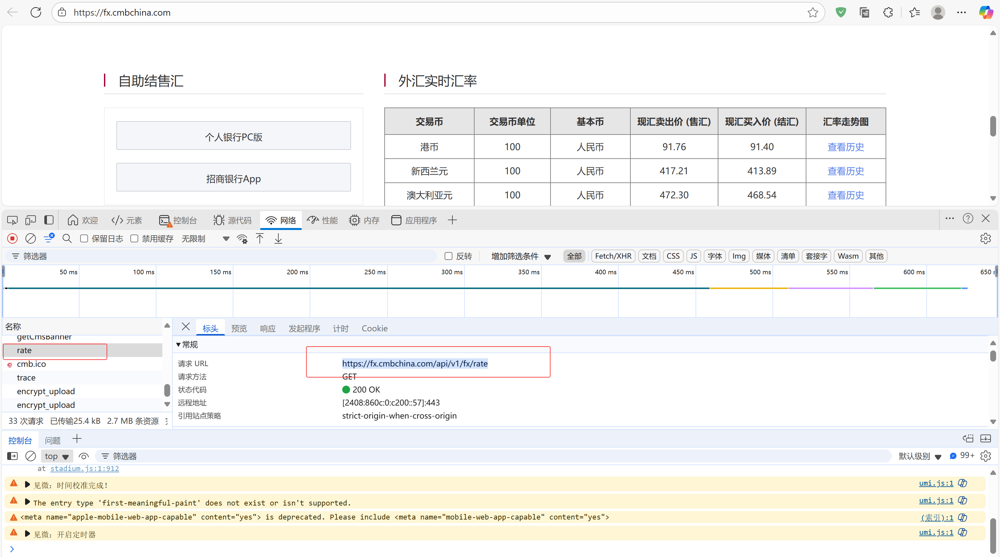
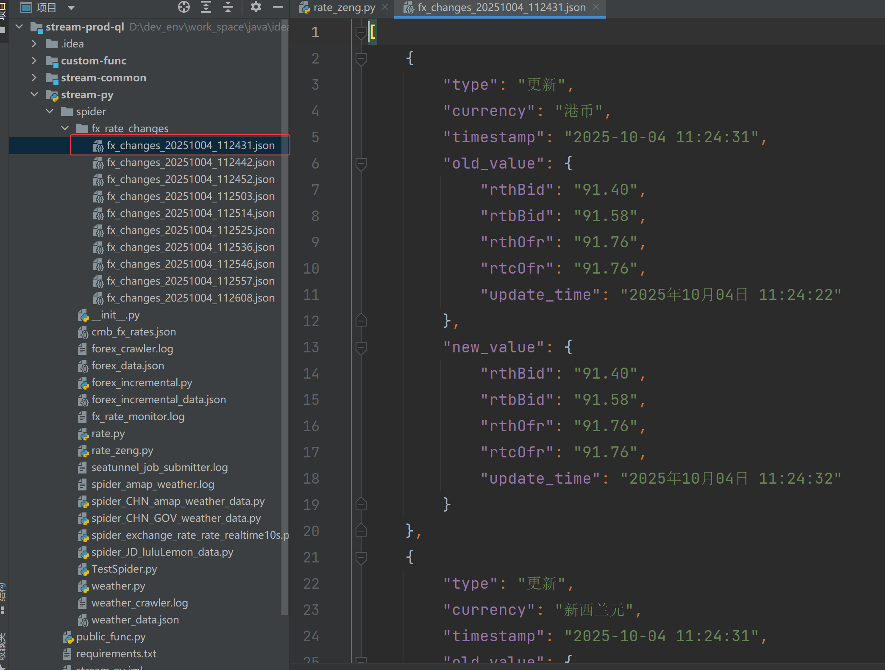
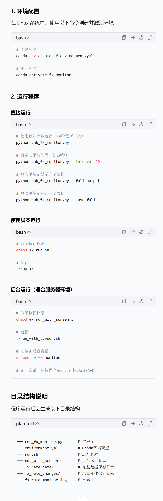

# 3. python spider 爬⾍
# 3.1 爬取中国⽓象数据, 数据要求 10 s 更新⼀次，增量更新
# 3.2 爬取中国外汇当⽇市场数据数据 10 s 更新⼀次，增量更新
# ps : 环境可移植, 代码需要在 linux 中可运⾏, 使⽤ conda 环境进⾏配置, 配置反爬⼿段进⾏预防

3.1
根据国家气象局网址
https://weather.cma.cn/web/text/area.html
爬取中国⽓象数据, 数据要求 10 s 更新⼀次，增量更新

数据存到json

3.2
根据招商银行外汇接口
https://fx.cmbchina.com/api/v1/fx/rate

爬取数据10s更新⼀次，增量更新

