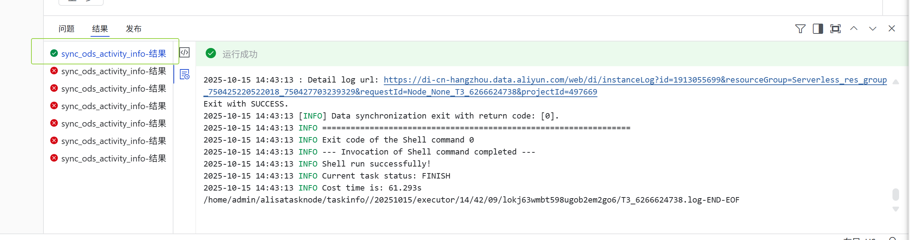
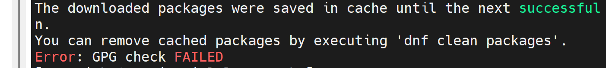
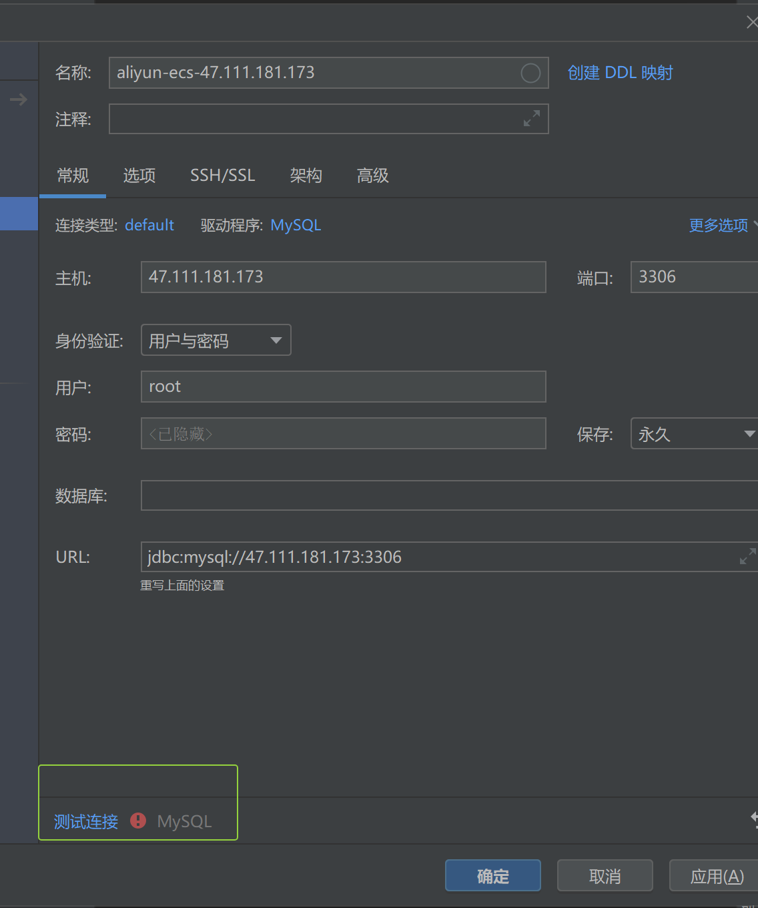
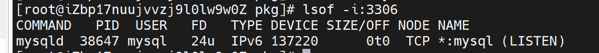
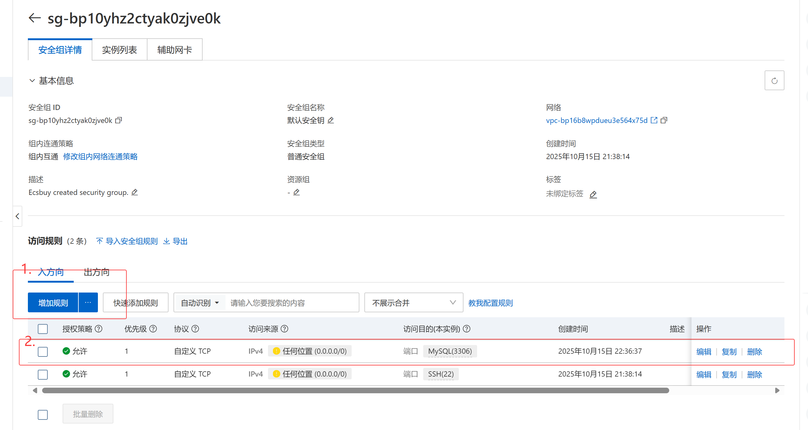

# 20251015

1.使用dataworks写离线项目

1.1
利用rds 连接mysql 传单表数据到maxcompute跑通

后因无法运行jar生成更多数据释放

1.2
利用esc搭建云服务

1.创建esc云服务器，利用公网ip 连接ssh 
2.下载常用依赖，安装mysql
dnf update -y
dnf install -y lsof vim net-tools
检查当前系统是否安装过MySQL:
rmp -qa|grep mariadb

yum install -y libaio
yum install -y autoconf

切换路径到pkg下

wget https://dev.mysql.com/get/mysql80-community-release-el9-3.noarch.rpm

rpm -ivh mysql80-community-release-el9-3.noarch.rpm

而后报个小错
dnf install mysql-community-server -y --nogpgcheck

# start
systemctl enable --now mysqld.service
systemctl status mysqld.service
grep "password" /var/log/mysqld.log
mysql -uroot -p
# [mysql]
alter user "root"@"localhost" identified by "Liqin123,./";
# 
远程连接
use mysql;
update user set host="%" where user="root";
flush privileges

3.dg连接mysql失败

但是端口是开着的

Mysql连接成功！！

