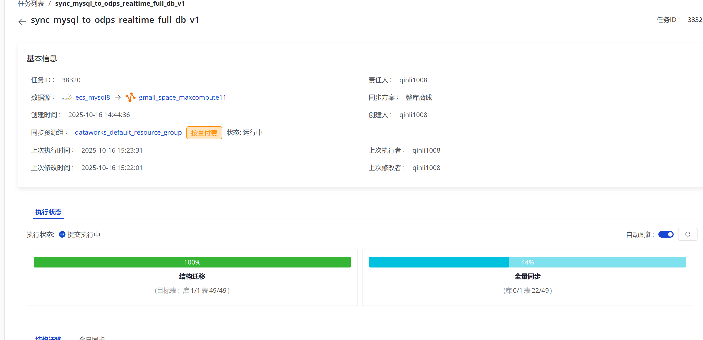
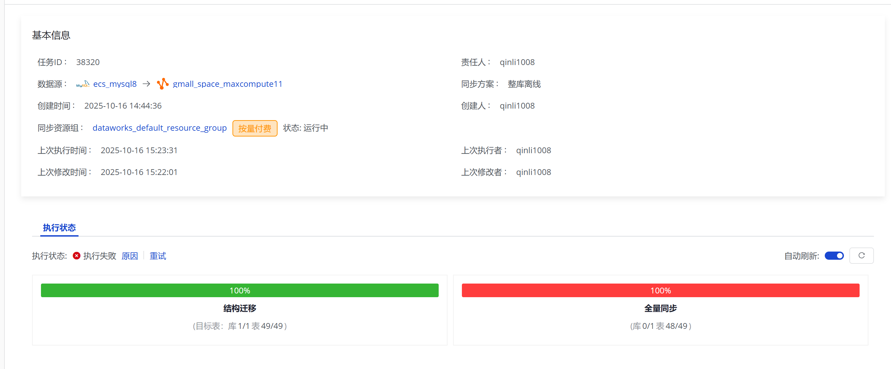
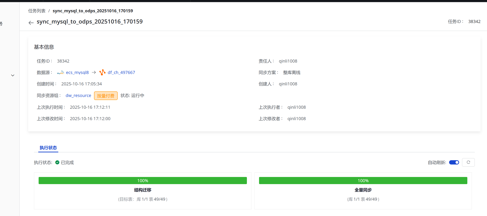
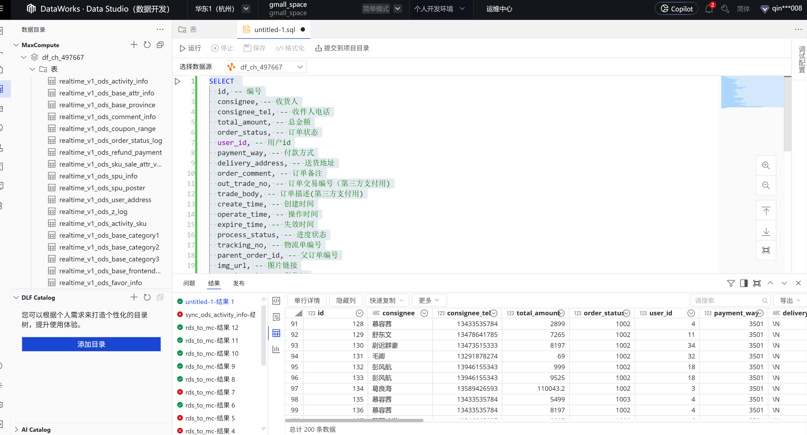
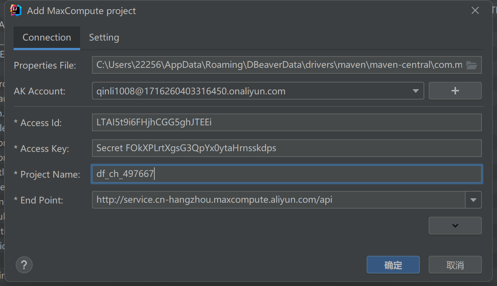
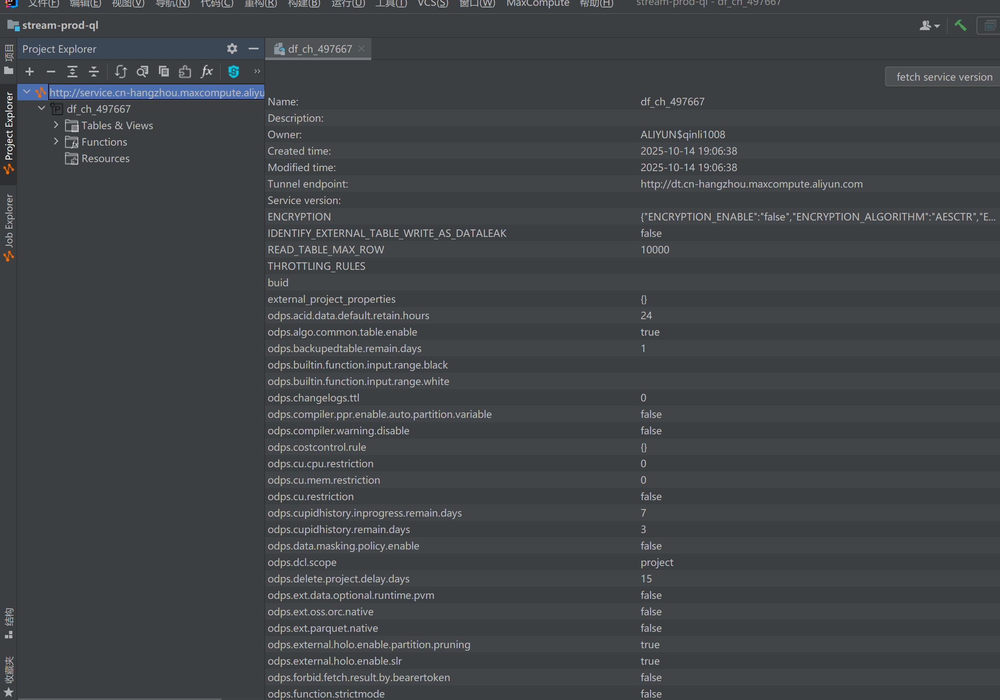
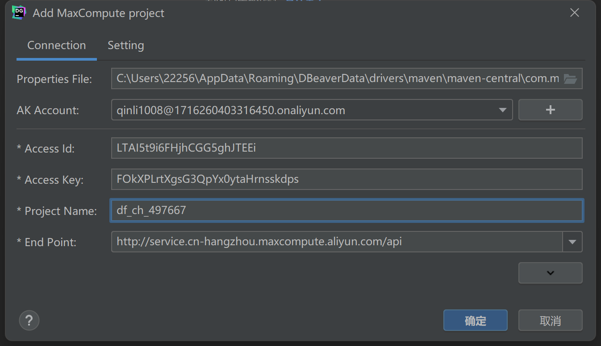
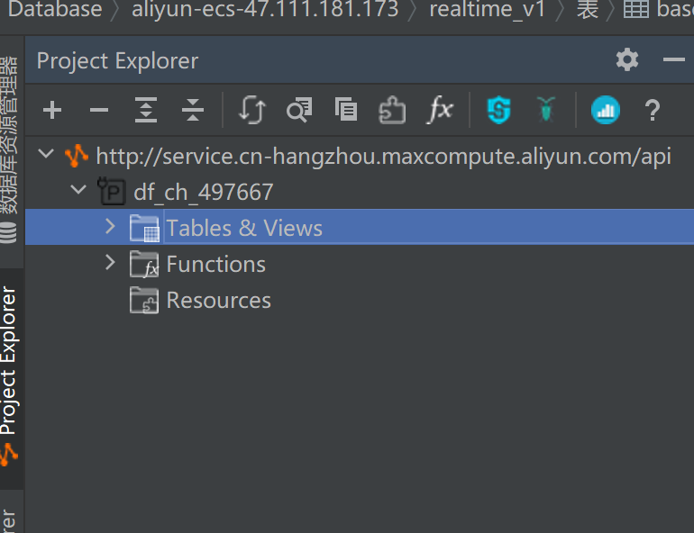

# 20251016

1.在47.111.181.173虚拟机安装 linux java8 

rpm -ivh oracle-j2sdk1.8-1.8.0+update181-1.x86_64.rpm

设置 JDK 激活

vim /etc/profile.d/env_profile
export JAVA_HOME=/usr/java/jdk1.8.0_181-cloudera
export CLASSPATH=.:$CLASSPATH:$JAVA_HOME/lib
export PATH=$PATH:$JAVA_HOME/bin

source /etc/profile.d/env_profile
java -version

# ecs_mysql8 同步整库离线 gmall_space_maxcompute11

2.ecs云服务器
同步数据成功

3.idea连接maxcompute成功！

4.datagrip连接maxcompute成功！

