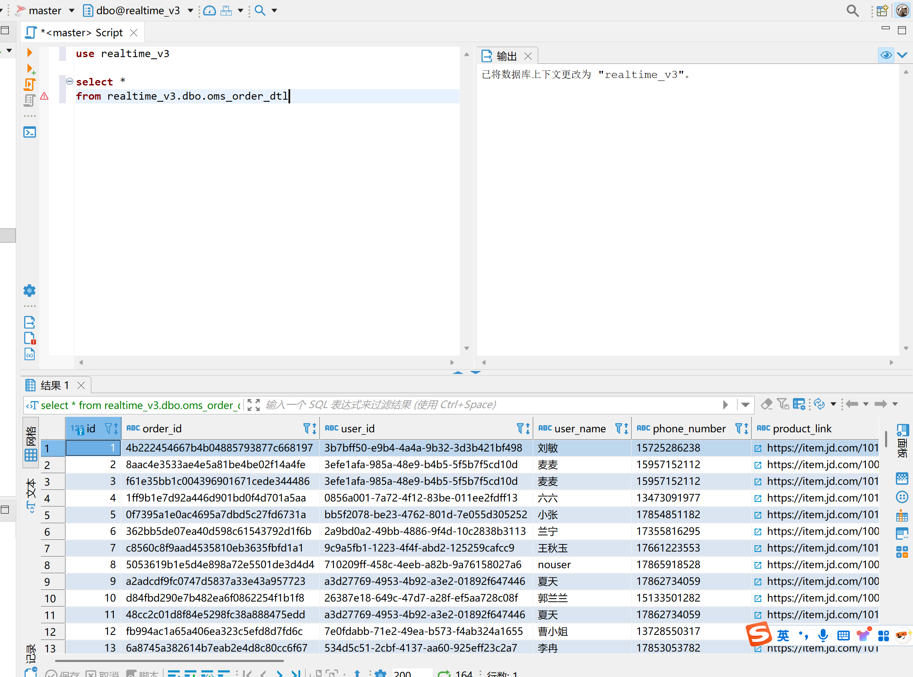

# 20251024

1.
idea连接postgresql,sqlserver
postgres   liqin123,./

sa  liqin123,./

2.
在pg里面创建数据库spider_db

vim /var/lib/pgsql/14/data/pg_hba.  修改为md5
给spider_db_backup.dump拖到安装的节点cdh02里面
运行 pg_restore -U postgres -d spider_db -F c spider_db_backup.dump
把spider_db_backup.dump导到pg里面

在sqlserver 创建数据库realtime_v3 和 建表

3.
在pycharm创建新项目，使用conda环境
导入requirements.txt 在下载包  pip install -r requirements.txt
导入stream_mock_data.py

修改ip、用户名、密码等参数，而后运行py文件，运行结束后手动暂停py文件

注：开着kafka

dbeaver成功

4.
idea创建类

